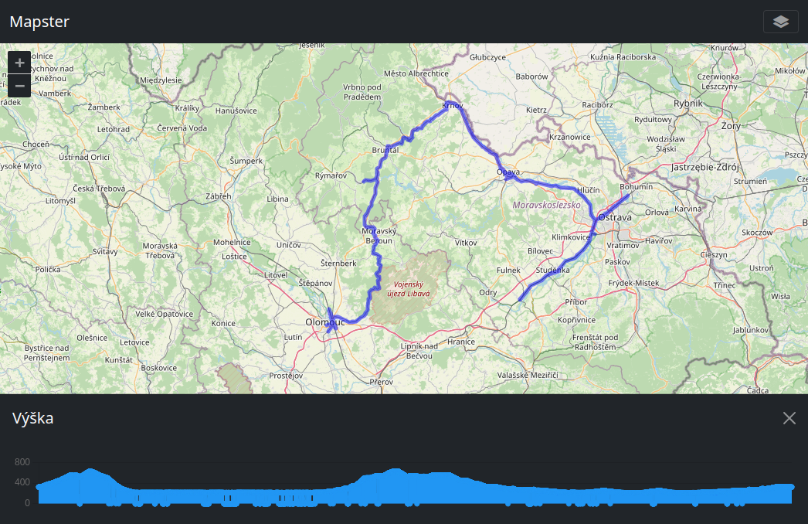
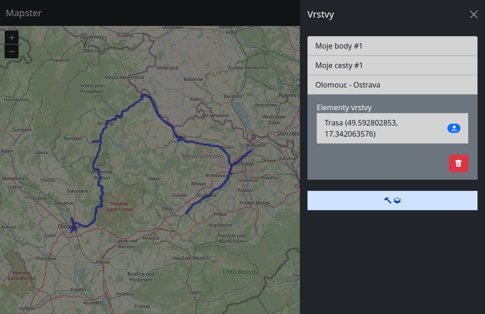
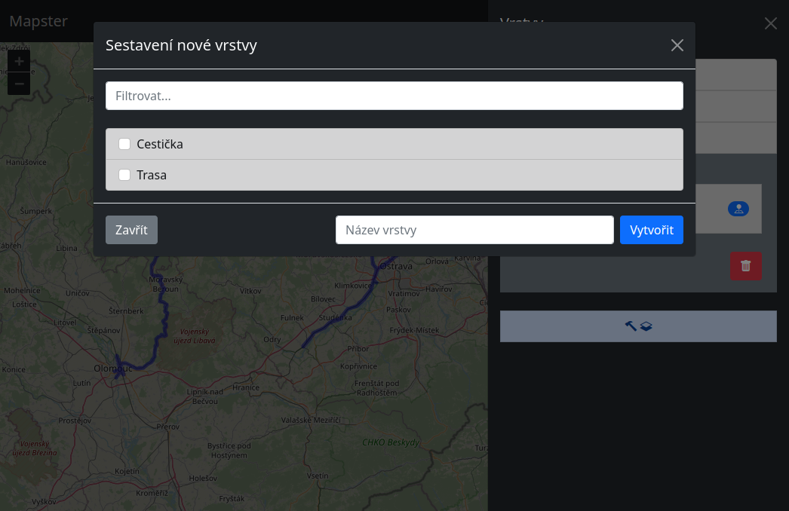

# 🗺️ Mapster
## Interaktivní železniční mapa od ENETu pro SŽ
> Projekt je v aktivním vývoji a stále přibývá nová funkcionalita.

<br><br>

## Kompilace klientské aplikace
```console
npm install
npm run build
```

## Snímky obrazovky

<div align="center">
    
</div>
<div align="center">
    Mapové UI
</div>
<br>

<div align="center">
    
</div>
<div align="center">
    List vrstev
</div>
<br>

<div align="center">
    
</div>
<div align="center">
    Sestavení nové vrstvy z databázového katalogu
</div>
<br>

***
<br>

<div align="center">
    
    <div align="center">
        &copy; Jan Němec 🤝 CENET VŠB-TUO - 2022
    </div>
</div>
