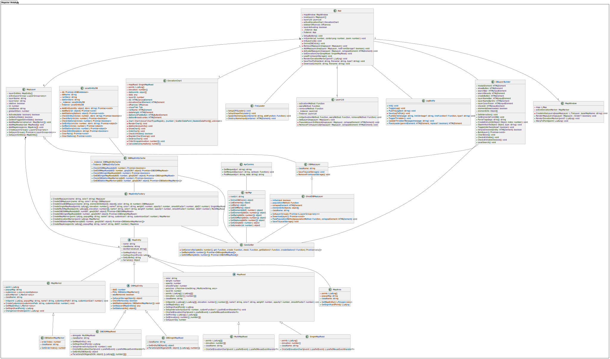
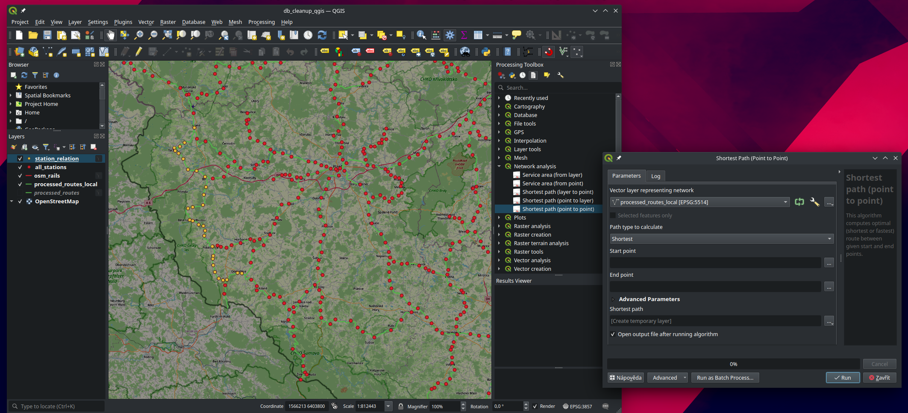
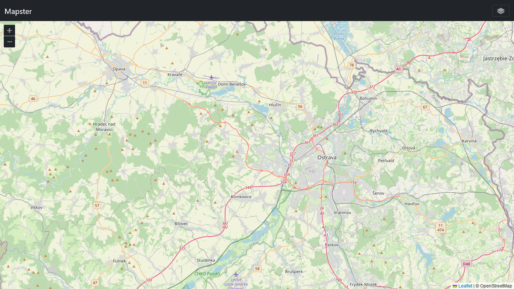
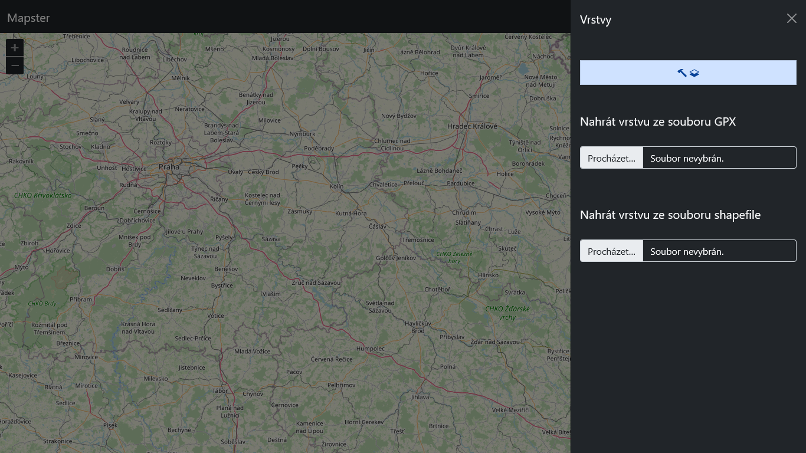
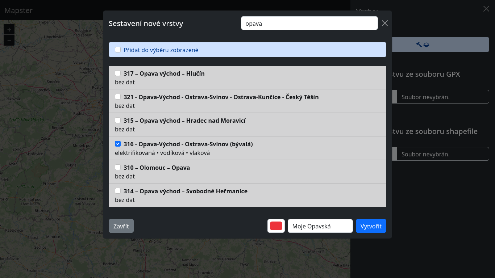
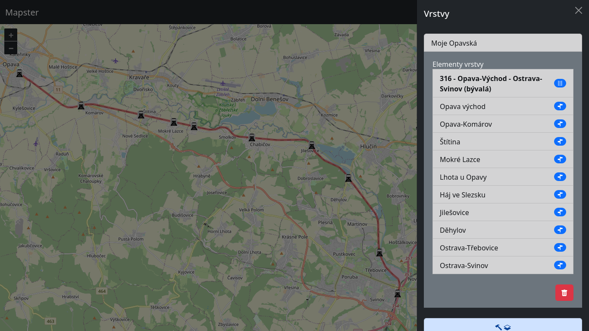
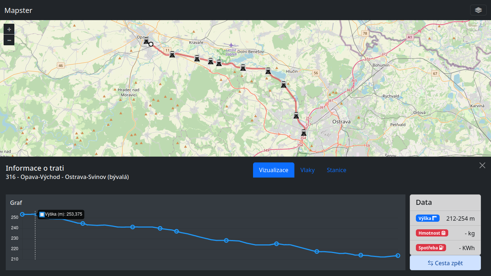

# Mapster
### Webová aplikace pro vizualizaci železničních tratí

> Následující dokument je náhledem do aktuálního stavu softwaru. Funkcionalita se bude s dalšími aktualizacemi měnit a rozšiřovat.

## Architektura

Celková architektura programu se dělí na tři komponenty.

### 1. Databáze

První z komponent je databáze, která staví na PosgreSQL, což je populární a otevřená objektově-relační databáze. Dále je na databázovém serveru nainstalováno rozšíření PostGIS, které databázi dodává schopnost efektivně pracovat s geodaty. Sem patří vše od bodů, přes přímky, až po složitější obrazce. Zároveň rozšíření umožňuje převádět data mezi různými standardizovanými souřadnicovými systémy (zejména pro účely sjednocení do celosvětového GPS WGS 84). Databáze slouží jak k uchovávání surových dat k dalšímu zpracování, tak jako úložiště poskytující provozní data k zobrazení v samotné aplikaci.

### 2. PHP Rest API

Další komponentou je REST API, které obstarává komunikaci mezi klientskou aplikací a databází. Hlavním účelem je tedy získávání mapových dat, což je zajištěno implementací konkrétních SQL dotazů. Mezi funkce API patří poskytování seznamu tratí a na vyžádání poskytování konkrétních dat k jednotlivým tratím.  S budoucím rozšířením je v plánu poskytovat v rámci PHP backendu i další služby, jako jsou výpočty rovnic vlakové spotřeby a správa přihlašování do aplikace. Odpovědi na dotazy pro API se vracejí ve formátu JSON (u geodat konkrétně GeoJSON).

### 3. Klientská aplikace

Poslední a zároveň uživatelsky nejzřetelnější částí je webová aplikace napsaná v jazyce [TypeScript](https://www.typescriptlang.org/). Velká část této komponenty je postavena kolem knihovny [LeafletJS](https://leafletjs.com/), která zajišťuje vykreslování samotného okna s mapou a všechny elementy v něm. K designu aplikace byl použit nejnovější HTML/CSS framework [Bootstrap](https://getbootstrap.com/) ve verzi 5 a kód je kompilován a minifikován do verze pro prohlížeč pomocí frameworku [Webpack](https://webpack.js.org/). Mezi funkce aplikace patří například výběr tratí ze seznamu, který je možno filtrovat pomocí vyhledávání, seskupování tratí do barevně odlišených vrstev a náhled na výškový profil. Ve vývoji je výpočet spotřeby jízdy po dané trati a s tím spojené rozhraní na volbu parametrů a vizualizaci výsledků grafy.

 

## Grafická reprezentace jednotlivých komponent

### 1. Relační diagram databáze (zjednodušeno, pouze data pro webovou aplikaci)

 

### 2. Diagram endpointů REST API

### 3. Třídní diagram klientské aplikace

 

## Původ dat

Data spojená s železničními tratěmi, která jsou zobrazovaná ve webové aplikaci, pocházejí z několika zdrojů.

### OpenStreetMap

Z komunitního projektu OpenStreetMap nejsou pouze samotné mapové podklady, které tvoří mapové okno (základ aplikace), ale i značné množství informací o železničních tratích. Komunita dobrovolníků a železničních nadšenců buduje tzv. [relaci](https://wiki.openstreetmap.org/wiki/Cs:%C5%BDelezni%C4%8Dn%C3%AD_trat%C4%9B_v_%C4%8CR) v rámci projektu OSM, která (až na některé výjimky) obsahuje seznam všech celostátních a regionální drah. V současné době se z tohoto zdroje čerpají zejména přibližné polohy, čísla a názvy jednotlivých tratí. V závislosti na dalším vývoji v získávání dat z dalších zdrojů se budou vybírat i další metadata pro účely filtrování tratí.

Dále byly z OpenStreetMap staženy a do databáze uloženy názvy a polohy stanic a zastávek, které jsou následně přiřazovány k jednotlivým tratím. V rámci již zmíněné [relace](https://wiki.openstreetmap.org/wiki/Cs:%C5%BDelezni%C4%8Dn%C3%AD_trat%C4%9B_v_%C4%8CR) jsou sice tratě a stanice/zastávky propojeny, ale pro neúplnost tohoto přiřazení (u některých tratí chybí úplně, nebo chybí některé zastávky) bylo spojení v databázi aplikace revidováno a doplněno za pomocí kombinace automatizovaných mechanismů a manuálních zásahů.

### Data od Správy železnic

[Správa železnic](https://www.spravazeleznic.cz/) poskytla pro účely využití v aplikaci export z vlastní databáze se zaměřenými tratěmi. Tato data mají oproti předchozímu zdroji výhodu, že obsahují (alespoň u některých tratí) i informaci o výšce. Datový soubor od SŽ ale nebylo možné použít samostatně z několika důvodů.

1. V exportu nejsou obsaženy žádné informace o rozdělení tratí podle jejich čísel
2. Síť je velmi hustá a obsahuje mnoho zbytečných větvení
   - Pro účely aplikace jsou jednotlivé koleje ve stanicích zbytečné a je naopak žádoucí, aby každá trať mohla být reprezentována přímou čárou (pro možnost realizace simulace spotřeby)
3. Nejsou obsaženy žádné informace o stanicích

Datový soubor byl zapracován do databáze aplikace a efektivně rozdělen podle předlohy dané OSM daty. Tento proces byl z velké části manuální a bude popsán níže.

 
## Zpracování dat

### OpenStreetMap

Velkou výhodou komunitního zaměření projektu OpenStreetMap, je fakt, že nabízí několik relativně dobře zdokumentovaných způsobů stažení úplných datových setů (například podle země) a dotazování se na jednotlivé relace, cesty, body zájmu a další prvky. Při naplňování databáze aplikace bylo využito [Overpass API](https://wiki.openstreetmap.org/wiki/Overpass_API) ve spojení s jednoduchým Python skriptem. Ten byl postupně rozšířen o možnost doplnění stanic/zastávek, z původní funkcionality stahování všech železničních tratí v ČR. Data z OSM databáze jsou skriptem přímo ukládána do PostgreSQL. Tyto informace jsou pro účely aplikace téměř výhradně read-only záležitostí. Další zpracování se týká hlavně dat od Správy železnic.

### Data od Správy železnic

Export od SŽ byl ve formátu shapefile, který je pro geodata velmi standardní. Jelikož v původním testování aplikace fungovala výhradně s offline daty (přímé nahrávání shapefile souborů), bylo nutné seznámit se souřadnicovým systémem S-JTSK. Takzvané *Křovákovo zobrazení* nabízí lepší přesnost na území České republiky, ale některé programy (jako je knihovna LeafletJS) s ním neumí pracovat a je tedy nutné ho převést na standardní GPS (tedy WGS 84).

Databázové rozšíření PostGIS si naštěstí dokáže poradit s mnoha souřadnicovými systémy, a tak není problém data uchovávat v původním formátu a převádět až při výstupu přes API. Pro import byla použita utilita [shp2pgsql](http://www.bostongis.com/pgsql2shp_shp2pgsql_quickguide_20.bqg), nad kterou byl napsán Bash skript upravující jakým způsobem jsou data uspořádána do tabulek. Metadata (která tvoří pouze informace o datech měření jednotlivých úseků) a samotné souřadnice tvoří dvě tabulky.

Po vyzkoušení několika způsobů mapování přesnějších SŽ dat na čísla tratí z OSM byl nakonec vybrán postup využívající doplňků grafové (síťové) analýzy v programu QGIS. Pro každou trať z OSM byl zvolen počáteční a koncový bod a pomocí implementace Dijkstrova algoritmu v modulu *Shortest path (point to point)* se vytvořila cesta, která byla při porovnání s OSM předlohou upravena, nebo rovnou přidána do databázové tabulky se zpracovanými tratěmi.

 
## Funkcionalita webové aplikace podrobně

Úvodní obrazovka aplikace je tvořena mapovým oknem, tlačítky přiblížení/oddálení a panelem s tlačítkem k otevření menu pro správu vrstev.

Menu pro správu vrstev obsahuje tlačítko pro *sestavení nové vrstvy* a možnost nahrání lokálního souboru GPX, nebo souboru shapefile.

Průvodce sestavením nové vrstvy obsahuje vyhledávací pole, kterým může uživatel filtrovat zobrazované tratě. Vyhledávání zahrnuje jak názvy a čísla tratí, tak další metadata (elektrifikovaná, vodíková atd.). Každá vrstva dostane název a barvu.

Nová vrstva se zobrazuje v menu. Po kliknutí se rozbalí a pod jejím názvem se odhalí všechny obsažené elementy (aktuálně kombinace tras a zastávek). Vrstvu je možné odebrat kliknutím na červené tlačítko s košem. V pozadí (na mapě) je vidět trať ze zvolené vrstvy s vyznačenými zastávkami.

Po kliknutí na trať v mapovém okně se zobrazí informační panel. Ten obsahuje především vizualizaci výšky, ke které přibude vizualizace spotřeby (ve vývoji) vykreslená v tom samém poli. V záložce *Vlaky* bude možné zvolit typový vůz pro výpočet spotřeby (nebo zadat parametry) a v záložce *Stanice* bude výpis všech stanic na trati.